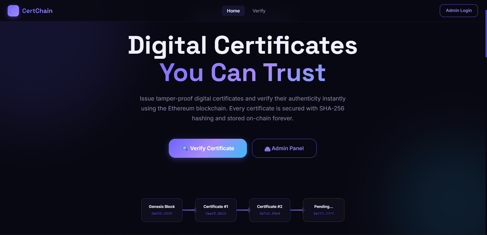

# CertChain — Blockchain Certificate Generation & Verification System



A full-stack web application for issuing and verifying **tamper-proof digital certificates** using the Ethereum blockchain.

   

---

## 📁 Project Structure

```
Certificate_Validation/
├── client/                   # React frontend (Vite)
│   ├── src/
│   │   ├── pages/            # Home, Login, Issue, Verify, Result
│   │   ├── components/       # Navbar, CertificateCard
│   │   ├── context/          # AuthContext (JWT)
│   │   └── utils/            # Axios API wrapper
├── server/                   # Node.js + Express backend
│   ├── config/               # MongoDB connection
│   ├── middleware/           # JWT auth middleware
│   ├── models/               # Mongoose schemas
│   ├── routes/               # Auth & certificate routes
│   ├── utils/                # Blockchain, hash, PDF generators
│   └── pdfs/                 # Generated certificate PDFs (auto-created)
├── contracts/                # Solidity smart contract
│   └── CertificateRegistry.sol
├── scripts/                  # Hardhat deployment script
│   └── deploy.js
├── test/                     # Contract unit tests
│   └── CertificateRegistry.test.js
├── hardhat.config.js
├── .env                      # Environment variables
└── README.md
```

---

## 🚀 Prerequisites

| Tool | Version | Download |
|------|---------|----------|
| Node.js | ≥ 18.x | https://nodejs.org |
| npm | ≥ 9.x | Included with Node |
| Ganache | Desktop or CLI | https://trufflesuite.com/ganache |
| MetaMask | Browser extension | https://metamask.io |
| MongoDB | Local or Atlas | https://mongodb.com (optional) |

---

## ⚙️ Setup Instructions

### Step 1 — Clone & Install Root Dependencies

```bash
# From inside Certificate_Validation/
npm install
```

This installs **Hardhat** and its toolbox.

---

### Step 2 — Install Server Dependencies

```bash
cd server
npm install
cd ..
```

---

### Step 3 — Install Client Dependencies

```bash
cd client
npm install
cd ..
```

---

### Step 4 — Start Ganache (Local Blockchain)

#### Option A: Ganache Desktop
1. Open Ganache Desktop
2. Click **"Quickstart Ethereum"**
3. Note the **RPC Server** URL (usually `http://127.0.0.1:7545`)
4. Copy any **Private Key** from the accounts list

#### Option B: Ganache CLI
```bash
npx ganache --port 7545
```

#### Option C: Hardhat Built-in Network (No Ganache needed)
```bash
npx hardhat node
# Network will run on http://127.0.0.1:8545
# Update INFURA_URL in .env to http://127.0.0.1:8545
```

---

### Step 5 — Configure `.env`

Edit the `.env` file in the project root:

```env
PORT=5000
MONGO_URI=mongodb://localhost:27017/certificate_db   # Optional
PRIVATE_KEY=<paste ganache account private key here>
INFURA_URL=http://127.0.0.1:7545                     # or :8545 for Hardhat node
CONTRACT_ADDRESS=                                    # Fill after Step 6
IPFS_API_URL=https://ipfs.infura.io:5001             # Optional
JWT_SECRET=change_this_to_a_long_random_string
ADMIN_USERNAME=admin
ADMIN_PASSWORD=admin123
```

> ⚠️ **Never commit your real PRIVATE_KEY to git!**

---

### Step 6 — Compile & Deploy the Smart Contract

```bash
# Compile Solidity contract
npm run compile

# Deploy to Ganache (running on port 7545)
npm run deploy:ganache

# OR deploy to Hardhat node (port 8545)
npm run deploy:local
```

The deployment script will print:
```
✅ CertificateRegistry deployed to: 0xYourContractAddress
```

**Copy that address** and paste it as `CONTRACT_ADDRESS=0xYourAddress` in `.env`.

---

### Step 7 — Run Contract Tests (Optional but recommended)

```bash
npm test
```

Expected output:
```
  CertificateRegistry
    Deployment
      ✓ should set the deployer as owner
    issueCertificate()
      ✓ should allow owner to issue a certificate
      ✓ should reject duplicate certificate IDs
      ...
  10 passing
```

---

### Step 8 — Start the Backend Server

```bash
cd server
npm run dev
```

Server starts at **http://localhost:5000**

> 💡 If MongoDB is not running, the server falls back to in-memory storage automatically.

---

### Step 9 — Start the Frontend

```bash
cd client
npm run dev
```

Frontend starts at **http://localhost:5173**

---

## 🌐 Pages & Routes

| URL | Description |
|-----|-------------|
| `http://localhost:5173/` | Home page |
| `http://localhost:5173/admin/login` | Admin login |
| `http://localhost:5173/admin/issue` | Issue certificate (protected) |
| `http://localhost:5173/verify` | Verify certificate |
| `http://localhost:5173/result/:id` | Verification result |

---

## 🔑 Default Admin Credentials

```
Username: admin
Password: admin123
```

*(Configure via `ADMIN_USERNAME` and `ADMIN_PASSWORD` in `.env`)*

---

## 📡 API Endpoints

| Method | Endpoint | Auth | Description |
|--------|----------|------|-------------|
| `POST` | `/api/auth/login` | No | Admin login → JWT |
| `POST` | `/api/auth/seed` | No | Seed admin to MongoDB |
| `POST` | `/api/certificates/issue` | ✅ JWT | Issue certificate |
| `GET` | `/api/certificates/verify/:id` | No | Verify certificate |
| `GET` | `/api/certificates/:id/qr` | No | Get QR code |
| `GET` | `/api/certificates/:id/download` | No | Download PDF |
| `GET` | `/api/certificates` | ✅ JWT | List all certificates |
| `GET` | `/api/health` | No | Server health check |

---

## ⛓ Smart Contract Details

**Contract:** `CertificateRegistry.sol`

| Function | Access | Description |
|----------|--------|-------------|
| `issueCertificate(bytes32 id, bytes32 hash, string name, string course)` | Owner only | Store certificate hash on-chain |
| `verifyCertificate(bytes32 id)` | Public | Retrieve hash + metadata |
| `transferOwnership(address newOwner)` | Owner only | Transfer admin rights |

**Events:** `CertificateIssued(bytes32 certId, bytes32 hash, string studentName, string course, uint256 issuedAt)`

---

## 🔐 Security Notes

- Private keys are **only in `.env`** — never in frontend code
- Admin routes are protected with **JWT Bearer tokens** (8 hour expiry)
- Certificate hashes use **SHA-256** — cryptographically secure
- Smart contract uses `onlyOwner` modifier for write operations
- Passwords stored as **bcrypt hashes** in MongoDB

---

## 🐛 Troubleshooting

| Issue | Solution |
|-------|----------|
| `CONTRACT_ADDRESS not set` | Deploy contract and paste address in `.env` |
| `ABI not found` | Run `npm run compile` first |
| Blockchain tx fails | Ensure Ganache is running and `PRIVATE_KEY` matches a funded account |
| MongoDB errors | Server falls back to in-memory storage automatically |
| CORS errors | Ensure frontend runs on port 5173 (Vite default) |
| PDF not generated | Ensure `server/pdfs/` is writable (auto-created) |

---

## 📦 Tech Stack

| Layer | Technology |
|-------|-----------|
| Frontend | React 18, React Router v6, Vite, Vanilla CSS |
| Backend | Node.js, Express.js, dotenv |
| Blockchain | Solidity 0.8.20, Hardhat, Ethers.js v6 |
| Local Chain | Ganache / Hardhat Network |
| Database | MongoDB + Mongoose (optional) |
| Auth | JWT (jsonwebtoken) + bcryptjs |
| PDF | PDFKit |
| QR Code | qrcode npm package |
| Hashing | Node.js crypto (SHA-256) |

---

*Built for educational purposes. For production use, deploy to a public testnet or mainnet and use proper key management.*
